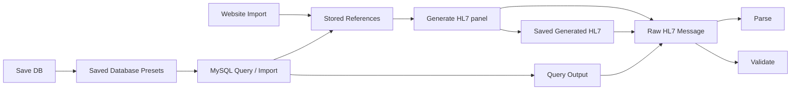

# Sample Data And UI Block Guide

This guide gives you a repeatable demo dataset and explains what every major UI block is for, what data it needs, and how to test it.

## Test Assets

| Asset | Path or URL | Use |
| --- | --- | --- |
| MySQL sample database | `samples/mysql/hl7_reference_lab_seed.sql` | Creates sample tables and HL7 rows for MySQL Workbench testing. |
| Manual HL7 copy/paste messages | `samples/hl7/manual_messages.md` | Tests parser and validator without MySQL. |
| Local website reference | `http://127.0.0.1:5173/sample-hl7-reference.html` | Tests website import without public internet. |

## High-Level Design



The app has two main data paths:

1. Generate an HL7 message from form inputs, then parse, validate, and optionally save it.
2. Bring external context or HL7 content from a website or MySQL, then use it as generation context or load it into the validator.

## Prepare MySQL Sample Data

1. Open MySQL Workbench.
2. Open `samples/mysql/hl7_reference_lab_seed.sql`.
3. Run the full script.
4. Confirm the database exists:

```sql
USE hl7_reference_lab;
SELECT COUNT(*) FROM order_reports_detail;
SELECT COUNT(*) FROM hl7_references;
SELECT COUNT(*) FROM external_hl7_messages;
```

Expected counts:

```text
order_reports_detail: 5
hl7_references: 3
external_hl7_messages: 2
```

## UI Blocks

| UI Block | Why It Exists | How To Test It |
| --- | --- | --- |
| Top Bar | Shows the app name, API target, and theme toggle. | Click `Dark` / `Light` and refresh. The theme should persist. |
| Workflow Overview Tiles | Gives a quick status summary for configured report type, selected reference, segment count, and validation state. | Generate or validate a message and watch tile values update. |
| Generate HL7 | Creates HL7 from configurable inputs such as version, report type, patient, provider, observations, and optional reference. | Pick `Lab Result`, keep defaults, click `Generate`. |
| Message Setup | Controls HL7 version, report type, and sending/receiving systems. | Change `HL7 Version` to `2.3`, click `Generate`, then validate against `2.3`. |
| Patient | Supplies PID segment details. | Change patient name or ID, click `Generate`, then check the `Readable` tab. |
| Provider And Visit | Supplies PV1/ORC/OBR provider, visit, and order context. | Change visit/order/provider values and inspect the generated segments. |
| Observations | Supplies OBX result rows for lab and radiology style messages. | Add an observation, generate, then check the new OBX in `Segments`. |
| Notes | Adds NTE comments to generated HL7. | Type a note, generate, and look for `NTE` in the raw message. |
| Stored References | Lets generated HL7 include guidance from saved profiles or imported references. Imported references can be removed. | Select `Default ORU R01 Lab Profile`, generate, and look for a reference note. |
| Website Import | Imports reference text from a documentation page. | Import `http://127.0.0.1:5173/sample-hl7-reference.html`, select it in `Stored References`, then generate. |
| MySQL Workbench Database | Connects to MySQL, previews SELECT results, imports references, and loads HL7 into the validator. | Use the sample database values below and run the sample queries. |
| Saved Database | Stores MySQL host, port, user, database, query, and column settings. Password is stored only when `Save password` is checked. | Fill details, click `Test`, optionally check `Save password`, then `Save DB`. Click `Save DB` again to see duplicate reuse. |
| Query Output | Shows rows returned by MySQL and provides `Use in Validator`. | Run a query returning `hl7_message`, then click `Use in Validator`. |
| Raw HL7 Message | The editable working area for generated or external HL7. | Paste a manual sample from `samples/hl7/manual_messages.md`. |
| Saved Generated HL7 | Stores generated HL7 only when the user clicks `Save`. Saved items can be removed. | Click `Generate`, then `Save`, then select it and click `Load to Validator` or `Remove`. |
| Parse / Readable / Segments | Converts HL7 into readable segment and field views. | Load or paste any valid sample and click `Parse`. |
| Validate / Validation | Checks structural and standards-oriented rules. | Load a valid sample and an invalid sample, then compare validation output. |

## MySQL Form Values

Use these values after running the seed SQL:

```text
Preset Name: Local HL7 Sample DB
Host: 127.0.0.1
Port: 3306
User: root
Password: your MySQL password
Database: hl7_reference_lab
Name Column: report_name
Custom Reference Name:
Content Column: hl7_message
```

Click `Test`. If it succeeds, `Save DB` becomes available.

## Sample Queries

### Preview And Validate A Lab Message

Use this query:

```sql
SELECT report_name, hl7_message
FROM order_reports_detail
WHERE type = 'HL72.3';
```

Use these column settings:

```text
Name Column: report_name
Custom Reference Name:
Content Column: hl7_message
```

Click `Run Query`, then click `Use in Validator` on the row. The row opens in the `Readable` parser tab. Select HL7 version `2.3`, then click `Validate`.

### Preview Multiple Message Types

```sql
SELECT type, report_name, report_category, hl7_version, status, hl7_message
FROM order_reports_detail
ORDER BY id;
```

Use this to test the query table layout and validate lab, radiology, ADT admission, and discharge examples.

### Import A MySQL Row As Stored Reference

```sql
SELECT report_name, hl7_message
FROM order_reports_detail
WHERE report_category = 'radiology_report'
LIMIT 1;
```

Use:

```text
Name Column: report_name
Custom Reference Name:
Content Column: hl7_message
```

Click `Import`. Then open `Stored References` and select the imported row. Click `Import` again to test duplicate detection; the app should select the existing reference instead of creating a second copy. If you first click `Use in Validator` on a query row, `Import` saves that same parsed HL7 row.

### Test Custom Reference Name

```sql
SELECT payload
FROM external_hl7_messages
WHERE expected_validation = 'valid'
LIMIT 1;
```

Use:

```text
Name Column:
Custom Reference Name: External Valid Payload
Content Column: payload
```

Click `Import`. This tests the path where the query has HL7 content but no name column.

### Test Invalid HL7 Validation

```sql
SELECT custom_label, payload
FROM external_hl7_messages
WHERE expected_validation = 'invalid'
LIMIT 1;
```

Use:

```text
Name Column: custom_label
Custom Reference Name:
Content Column: payload
```

Click `Run Query`, then `Use in Validator`, then `Validate`. The validation tab should report missing ORU result segments.

### Test Default Reference Table

```sql
SELECT name, content
FROM hl7_references
WHERE report_type = 'lab_result'
LIMIT 1;
```

Use:

```text
Name Column: name
Custom Reference Name:
Content Column: content
```

Click `Import`, select the imported reference in `Stored References`, then click `Generate`.

## End-To-End Test Checklist

1. Start backend and frontend.
2. Run the MySQL seed script in Workbench.
3. Import the local website reference:

```text
http://127.0.0.1:5173/sample-hl7-reference.html
```

4. Select the imported website reference in `Stored References`.
5. Generate a lab HL7 message.
6. Click `Save`.
7. Select the saved generated message.
8. Click `Load to Validator`.
9. Click `Parse`.
10. Click `Validate`.
11. Fill MySQL database details.
12. Click `Test`.
13. Click `Save DB`.
14. Click `Save DB` again to confirm duplicate preset reuse.
15. Run the `HL72.3` query.
16. Click `Use in Validator`.
17. Validate against HL7 version `2.3`.
18. Import a MySQL reference.
19. Import the same MySQL reference again to confirm duplicate reference reuse.
20. Paste the invalid manual HL7 sample and validate it.
21. Toggle dark/light theme.

## What Each Sample Proves

| Sample | Feature Proven |
| --- | --- |
| `hl7_references` rows | Stored reference import and generation context. |
| `order_reports_detail` lab rows | MySQL query, filtered query, validator load, version-specific validation. |
| `order_reports_detail` radiology row | Radiology report generation/import path. |
| `order_reports_detail` ADT rows | ADT admission/discharge validation path. |
| `external_hl7_messages` valid row | Custom reference name import. |
| `external_hl7_messages` invalid row | Validator error display. |
| Local website HTML | Website import without internet dependency. |
| Manual HL7 markdown | Parser/validator testing without database dependency. |
