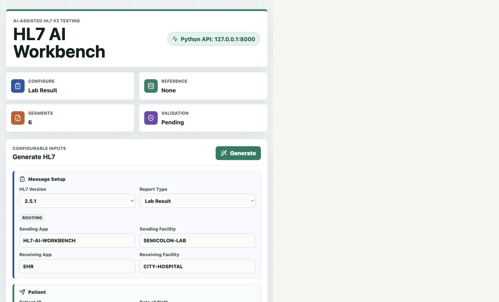
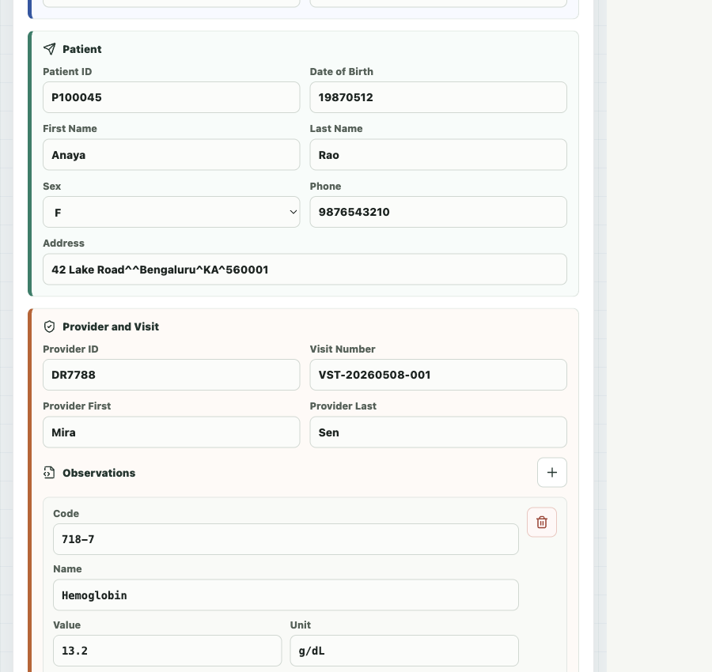
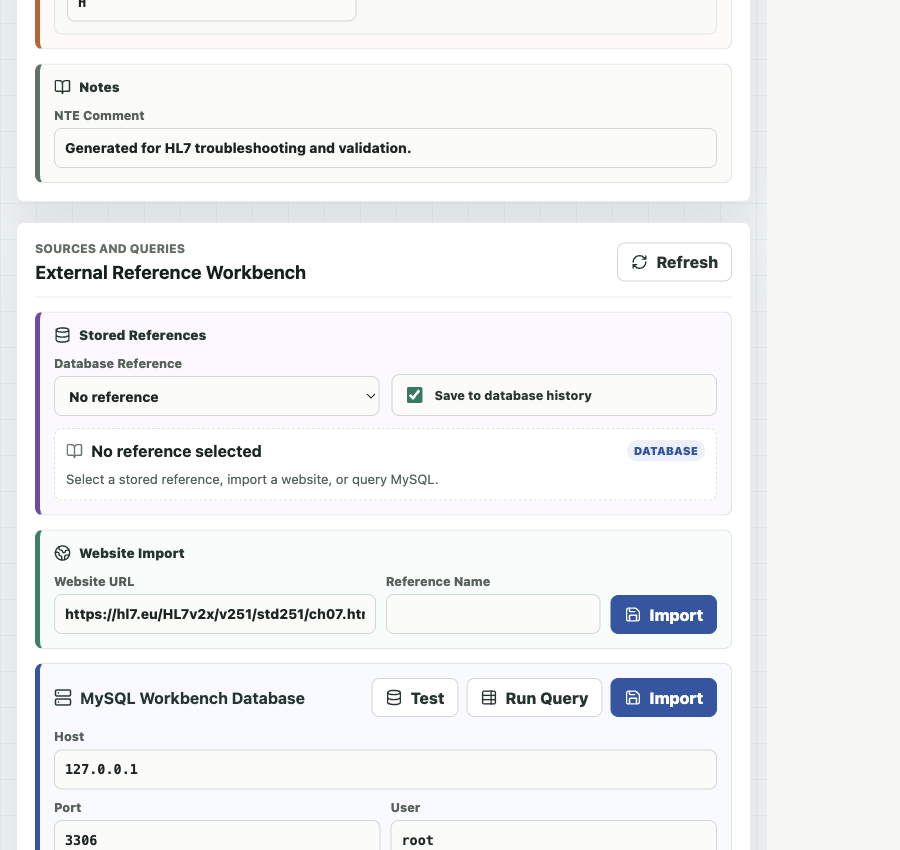
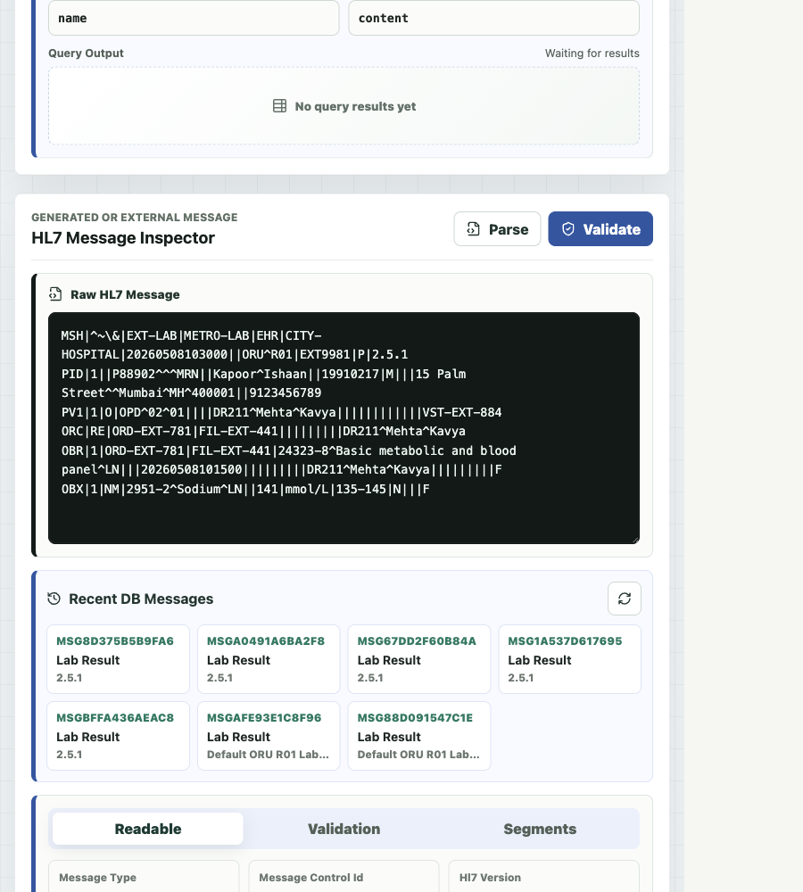

# HL7 AI Workbench User Guide

This guide explains how to run the app, generate HL7 messages, parse and validate external HL7, import website references, and connect a MySQL Workbench database.

For a full sample dataset and a description of every UI block, see [SAMPLE_DATA_AND_BLOCK_GUIDE.md](SAMPLE_DATA_AND_BLOCK_GUIDE.md).

## 1. Start The Application

Start the backend API:

```bash
python3 -m venv .venv
. .venv/bin/activate
pip install -r backend/requirements.txt
cd backend
uvicorn app.main:app --reload --port 8000
```

Start the frontend in a second terminal:

```bash
cd frontend
npm install
npm run dev
```

Open the app at:

```text
http://127.0.0.1:5173/
```

The status pill should show that the Python API is available.



## 2. Generate An HL7 Message

Use the `Generate HL7` panel to configure the message:

- Choose the `HL7 Version`.
- Choose the `Report Type`.
- Fill routing fields such as sending app, sending facility, receiving app, and receiving facility.
- Fill patient details.
- Fill provider and visit details.
- Click `Generate` to create a message.
- After the generated HL7 appears, click `Save` to store it in `Saved Generated HL7`.

The generated message appears in the `HL7 Message Inspector` panel. Generated HL7 is not saved automatically. The `Save` button appears only after you click `Generate`.

To load a previously generated message again:

1. Go to `HL7 Message Inspector`.
2. Open the `Generated HL7 Dropdown` in `Saved Generated HL7`.
3. Choose a saved message.
4. Click `Load to Validator`.
5. The message is copied into `Raw HL7 Message`.
6. Click `Parse` or `Validate`.

To remove one saved generated HL7 message, choose it in the dropdown and click `Remove`.

To clear saved generated HL7 history, stop the backend if SQLite reports a lock, then run this from the project root:

```bash
sqlite3 backend/hl7_workbench.db "DELETE FROM message_history;"
```

After clearing, reload the app or click the refresh icon in `Saved Generated HL7`.

## 3. Add Or Edit Observations

For lab and radiology style messages, use the `Observations` section.

- `Code`: observation identifier, for example `718-7`.
- `Name`: readable observation name, for example `Hemoglobin`.
- `Value`: result value, for example `13.2`.
- `Unit`: result unit, for example `g/dL`.
- `Range`: reference range, for example `12.0-15.5`.
- `Flag`: abnormal flag, for example `N`, `H`, or `L`.

Use the plus button to add an observation and the delete button to remove one.



## 4. Import HL7 Reference Content From A Website

Use `External Reference Workbench` > `Website Import`.

1. Paste a website URL that contains HL7 documentation or reference text.
2. Optionally enter a custom `Reference Name`.
3. Click `Import`.
4. Select the imported reference in `Stored References`.
5. Generate a message again.

To remove an imported website or MySQL reference, select it in `Stored References` and click `Remove`. Built-in default database references are protected.

Example website to load:

```text
https://www.hl7.eu/HL7v2x/v251/std251/ch07.html
```

This page covers HL7 v2.5.1 Chapter 7 Observation Reporting, including ORU observation/result messaging.

For offline/local testing while the frontend is running, use:

```text
http://127.0.0.1:5173/sample-hl7-reference.html
```

When a reference is selected, the generated message can include an `NTE` reference note so reviewers know which external source was used.

## 5. Connect MySQL Workbench

Use `External Reference Workbench` > `MySQL Workbench Database`.

Fill these fields:

- `Preset Name`: a friendly name to save this database setup for later.
- `Host`: usually `127.0.0.1` for a local MySQL server.
- `Port`: usually `3306`.
- `User`: your MySQL user, for example `root`.
- `Password`: your MySQL password.
- `Database`: the database name shown in MySQL Workbench.

Click `Test` first. If the database name is missing or incorrect, the app lists available databases so you can select the correct one.

To reuse the database setup later:

1. Enter the database details, query, and column names.
2. Click `Test`.
3. Optional: check `Save password` if you want this local app to remember the MySQL password.
4. After the current database details test successfully, click `Save DB`.
5. Later, choose it from `Saved Database`.
6. Click `Load`.
7. Re-enter the password only if it was not saved.

Saved passwords are stored in the local SQLite app database on this machine. Leave `Save password` unchecked if you do not want the app to keep it.



## 6. Query MySQL And See Results

Only read-only single-statement `SELECT` queries are allowed. `WHERE` filters are supported, and one trailing semicolon is allowed.

Example query:

```sql
SELECT * FROM order_reports_detail WHERE type = 'HL72.3';
```

Click `Run Query` to preview rows in the `Query Output` area.

To validate an HL7 message returned by MySQL:

1. Set `Content Column` to the column that contains the HL7 message text.
2. Click `Run Query`.
3. In the query output table, click `Use in Validator` for the row you want.
4. The HL7 text is loaded into `Raw HL7 Message`, parsed, and opened in the `Readable` tab.
5. Click `Validate`.

If the row cannot be shown in the parser view, the MySQL section displays a message. Check that `Content Column` points to raw HL7 content that starts with `MSH|`.
If the row loads successfully and you click `Import`, the app saves the same HL7 content that was loaded into the validator.

For importing a row as a reusable reference:

1. Make sure the query returns a column that can be used as the reference name.
2. Make sure the query returns a column that contains HL7 reference text or an HL7 message.
3. Set `Name Column` to the name column.
4. If the query has no name column, enter a value in `Custom Reference Name` instead.
5. Set `Content Column` to the content/message column.
6. Click `Import`.

Before saving, the app checks whether the same MySQL reference or saved database preset already exists. If it does, the existing item is selected instead of creating a duplicate.

Example reference table:

```sql
CREATE DATABASE hl7_reference_lab;
USE hl7_reference_lab;

CREATE TABLE order_reports_detail (
  id INT AUTO_INCREMENT PRIMARY KEY,
  type VARCHAR(50) NOT NULL,
  report_name VARCHAR(255) NOT NULL,
  hl7_message TEXT NOT NULL
);

INSERT INTO order_reports_detail (type, report_name, hl7_message)
VALUES (
  'HL72.3',
  'Sample HL7 2.3 Lab Report',
  'MSH|^~\\&|LAB|HOSPITAL|EHR|HOSPITAL|20260508103000||ORU^R01|MSG001|P|2.3\rPID|1||P100045^^^MRN||Rao^Anaya||19870512|F\rOBX|1|NM|718-7^Hemoglobin^LN||13.2|g/dL|12.0-15.5|N|||F'
);
```

For a complete MySQL sample dataset, run `samples/mysql/hl7_reference_lab_seed.sql` from MySQL Workbench. It creates lab, radiology, ADT, valid, invalid, duplicate-check, and custom-name examples.

For this table, use:

```sql
SELECT report_name, hl7_message
FROM order_reports_detail
WHERE type = 'HL72.3';
```

Then set:

```text
Name Column: report_name
Custom Reference Name: 
Content Column: hl7_message
```

If your query only returns the HL7 message column, use:

```text
Name Column:
Custom Reference Name: New HL7
Content Column: hl7_message
```

## 7. Parse And Validate HL7 Messages

Use the `HL7 Message Inspector` for generated or external messages.

- Paste or edit an HL7 message in `Raw HL7 Message`.
- Or load one from `Saved Generated HL7`.
- Click `Parse` to convert it into readable fields and segments.
- Click `Validate` to check structure and common HL7 v2 requirements.
- Use the `Readable`, `Validation`, and `Segments` tabs to inspect results.



## 8. Change Theme

Use the `Dark` or `Light` button in the top bar to switch the UI theme. The app remembers the selected theme in the browser, so the same theme is restored after refresh.

## 9. Troubleshooting

If a MySQL filtered query fails:

- Confirm the database field contains the correct database name.
- Run `Test` before `Run Query`.
- Use single quotes around string values, for example `WHERE type = 'HL72.3'`.
- Use only one SQL statement.
- A single trailing semicolon is okay, but multiple statements are blocked.

If website import fails:

- Check that the URL is reachable in your browser.
- Prefer public documentation pages without login requirements.
- Try a direct HL7 documentation page instead of a homepage.
- If a public documentation URL has certificate/network problems, use the local sample page: `http://127.0.0.1:5173/sample-hl7-reference.html`.

If parsing or validation fails:

- Make sure the message starts with `MSH`.
- Make sure segments are separated by line breaks.
- Select the expected HL7 version before validation.
- Check the `Validation` tab for exact missing fields or unsupported structure.
