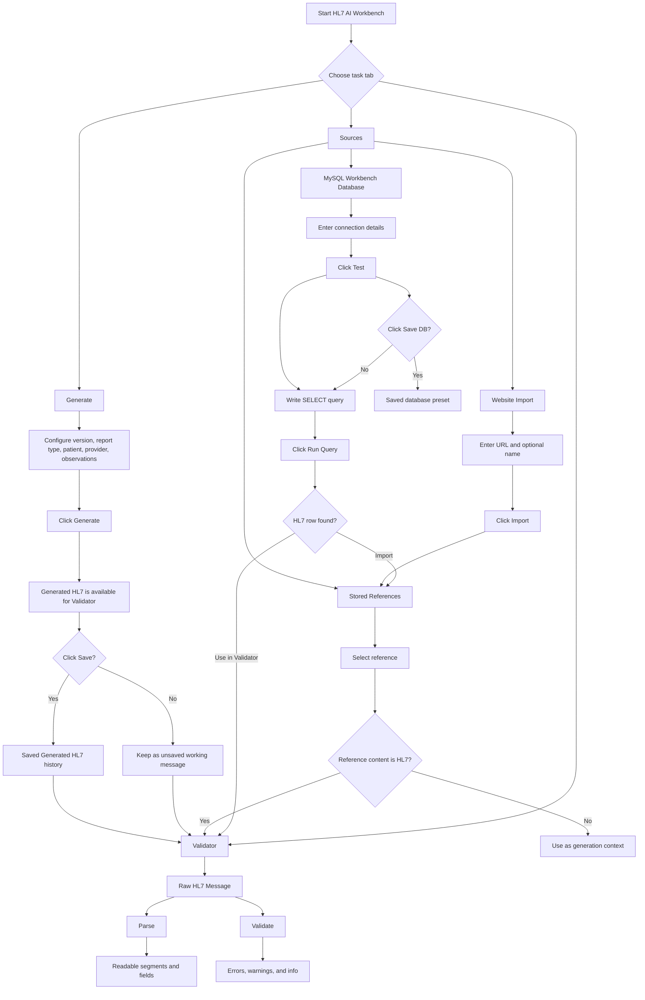
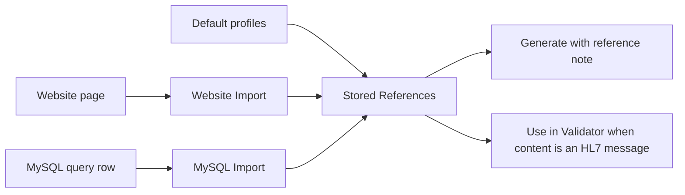

# HL7 AI Workbench Workflow Diagram

This diagram shows how generated HL7, stored references, website imports, MySQL imports, validation, and saved items work together.

## Main Flow

## Reference Flow

## What Each Save Does

| Action | What It Saves | Where It Appears Later |
| --- | --- | --- |
| `Save` after `Generate` | The generated HL7 message | `Saved Generated HL7` in the Validator tab |
| `Import` in Website Import | Website text as a reusable reference | `Stored References` |
| `Import` in MySQL | Query result content as a reusable reference | `Stored References` |
| `Save DB` | MySQL host, user, database, query, columns, and optional password | `Saved Database` dropdown |

## Validator Behavior

The Validator starts empty by default. HL7 content appears there only after one of these actions:

- Click `Generate` to create a new HL7 message.
- Click `Use in Validator` on a stored HL7 reference or MySQL query row.
- Click `Load to Validator` for a saved generated HL7 message.
- Paste or type HL7 manually into `Raw HL7 Message`.

After content is loaded, click `Parse` for a readable view or `Validate` for structural checks.

